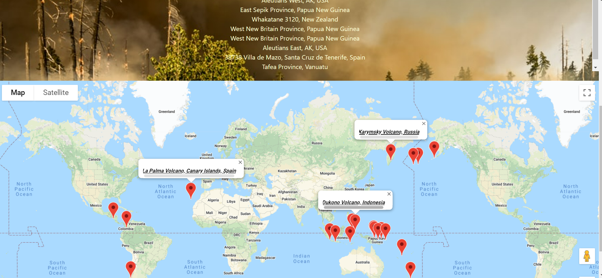
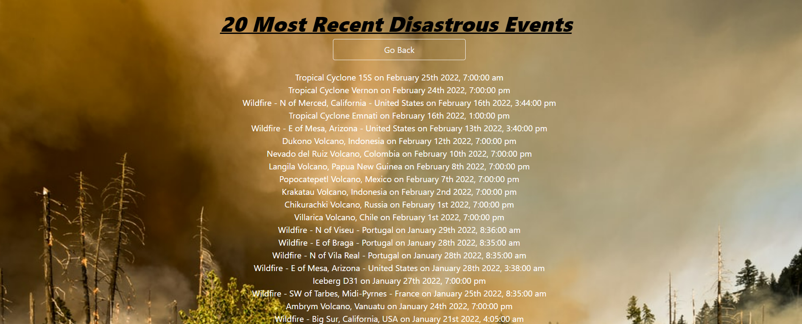

# Disaster-Factor


## Description

This website utilizes The Earth Observatory Natural Event Tracker (EONET) in conjunction with the GOOGLE Maps API to provide continually updated natural event data plotted to a map. This application will show natural event occurences and hold the search data in localStorage to be pulled upon request. Users can select from several different categories to see if the area they want to know about has experienced any of that type of natural occurrence in the past 365 days.

## User Story

```python
GIVEN the increase in major natural disaster occurrences and
the need to feel safe
WHEN I make a selection from the categories drop down
THEN I am presented with all of the events in that category
for the past 365 days and that data is stored in local storage
WHEN I scroll to the map section of the page
THEN I am presented with pin indicators on the map that shows
the location of the natural event
WHEN I click on the pin, the event nomenclature is presented
```

## Contributing

[EONET API](https://eonet.gsfc.nasa.gov/)

[Google Maps API](https://developers.google.com/maps/documentation/javascript/overview)

HTML, CSS, Bulma, Java Script, MomentJS, NASA EONET API, Google Maps API, JPEGs, GIFs

Pull requests are welcome. For major changes, please open an issue first to discuss what you would like to change.

## Developers

[Jared Haralson](https://github.com/jhara0994)

[Jing Liu](https://github.com/jing-liu-778)

[Vincent Hobbs](https://github.com/icyhobbs?tab=repositories)

## Mock up





## Questions

If you have any questions about this projects, please contact me directly at jingliu788@gmail.com. You can view more of my projects at https://github.com/jing-liu-778.
